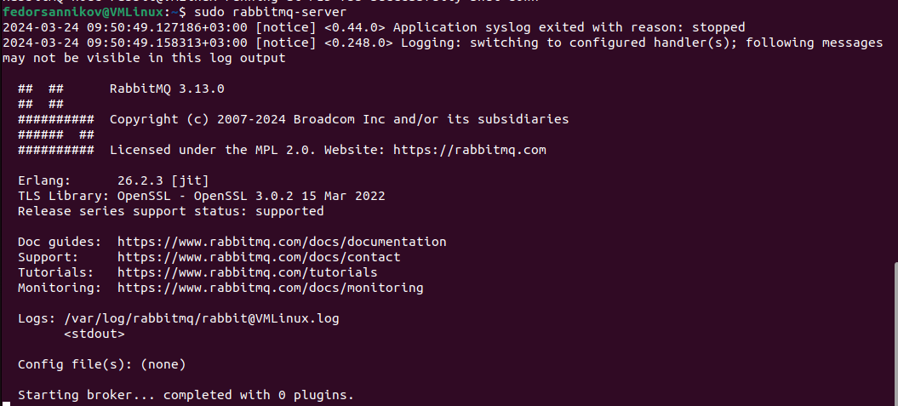
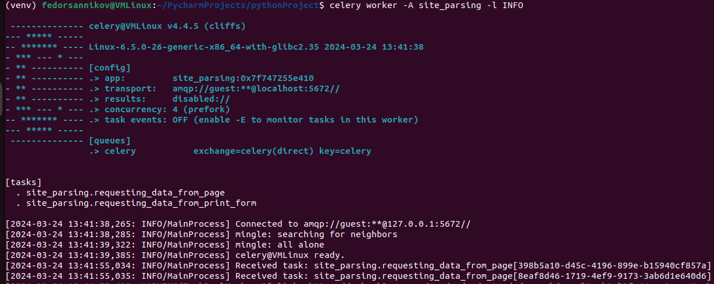
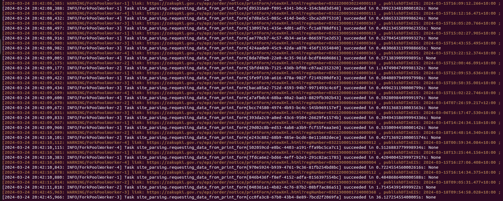

## Тестовое задание от Тендерплан

Сайт государственных закупок (ЕИС), главная страница поиска тендеров: 
https://zakupki.gov.ru/epz/order/extendedsearch/results.html , с постраничной 
разбивкой по 10 тендеров.

Нужно реализовать программу на Python, которая обходит первые две страницы по 44ФЗ:
https://zakupki.gov.ru/epz/order/extendedsearch/results.html?fz44=on&pageNumber=1 
https://zakupki.gov.ru/epz/order/extendedsearch/results.html?fz44=on&pageNumber=2 

При обходе, у каждого элемента списка (тендера), нужно собирать ссылку на его печатную форму:

Эти ссылки имеют вид 
https://zakupki.gov.ru/epz/order/notice/printForm/view.html?regNumber=0338300047924000057 . 
Заменив view.html на viewXml.html, получим ссылку на печатную XML-форму 
(https://zakupki.gov.ru/epz/order/notice/printForm/viewXml.html?regNumber=0338300047924000057). 
Распарсив этот XML, для каждого тендера нужно получить значение XML-поля publishDTInEIS, или 
None в случае его отсутствия.

Для простоты, результат вывести прямо в консоль (например, обычным print()), в виде 
пары “ссылка на печатную форму”-”дата публикации”.

## Пояснение

1. В качестве брокера сообщений использовался RabbitMQ 3.13.0 :

2. Для запуска Сelery в bash использовать команду celery worker -A site_parsing -l INFO :

3. Установить все зависимости (кроме RabbitMQ 3.13.0) pip install -r requirements.txt .

4. Работоспособность проверялась на Ubuntu 22.04 :
